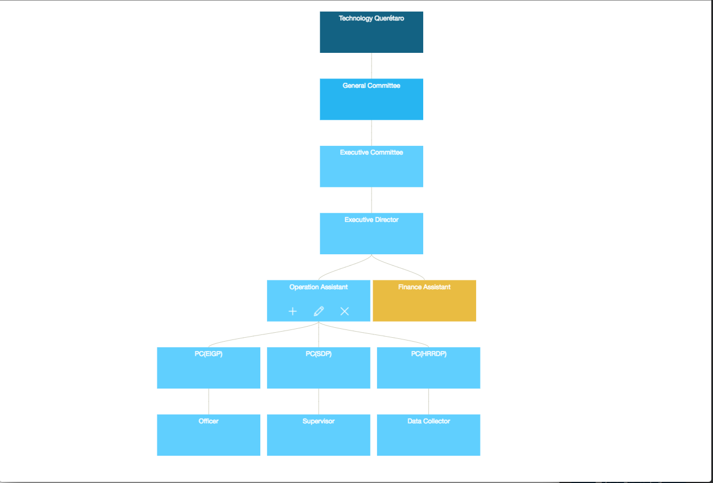

# OrgChartJit

## Synopsis
A javascript tool for viewing and managing organizational charts. Using [JIT JS](http://philogb.github.io/jit/index.html).

[DEMO](http://rlopez0689.github.io/OrgChartJit/)

## Code Example
Using a JSON you can display an organizational chart. Also, you can add nodes, delete nodes, edit nodes and view extra information of the nodes.

It has 3 states. Normal, Selected and Collapse.

## Motivation
I was searching in the internet for a tool to make organizational charts. I found Jit and i think i`ts amazing. 
So i think i can do something with that to make an organization chart that can be very general and flexible to adapt to specific purposes.

## Installation
Download the zip file. And execute index.html

## Contributors
I`ll be honor if you help me improving this tool. The main js file is the tree.organization.js, i'ts the one i made over the JIT js Tool.

## License
MIT.
You are welcome to do whatever you want with the code.

Please let me know if you have a doubt or anything related to the project.
